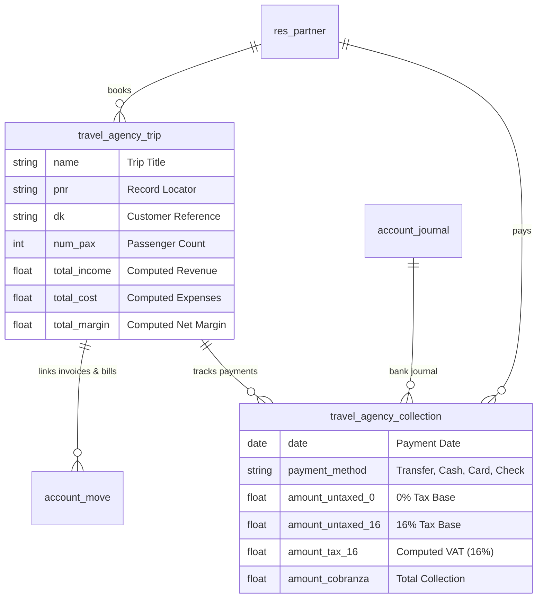

# ✈️ Odoo ERP Module: Travel Agency Operations & Collections


Custom Odoo ERP module (`travel_agency_operations`) extending core Odoo Accounting (`account.move`) to handle specialized travel agency workflows: PNR reservation tracking, trip profitability/margin calculations, tax-segmented payment collection ledgers, and automated payment generation.

---

## 🌟 Features & Business Logic

### 1. 🧳 Trip Management (`travel.agency.trip`)
- **PNR & Reservation Tracking**: Stores PNR Record Locators, customer reference IDs (DK), passenger counts (PAX), destinations, travel dates, and travel agents.
- **Automated Profitability & Net Margin Calculation**: Dynamically computes Total Revenue, Total Provider Cost, and Net Profit Margin by aggregating linked posted customer invoices (`out_invoice`) and vendor bills (`in_invoice`).

### 2. 💳 Specialized Collection Reports (`travel.agency.collection`)
- **Multi-Tax Rate Breakdown**: Segments payments into 0% tax-exempt base, 16% taxable base, transfers, and calculated VAT/IVA.
- **Reference Auto-Matching**: Computes and matches customer (`res.partner`) and trip (`travel.agency.trip`) references automatically based on DK numbers.
- **Direct Payment Generation**: Includes action logic (`action_generate_payment`) to spawn native Odoo `account.payment` records directly from collection entries.

### 3. 🧾 Invoice Integration (`account.move`)
- Inherits `account.move` to add a direct relational link (`viaje_id`) to travel trips.

---

## 📐 Data Architecture



---

## 📁 Module Directory Structure

```
travel_agency_operations/
├── __manifest__.py                 # Odoo addon manifest declaration
├── __init__.py                     # Python root loader
├── models/
│   ├── __init__.py                 # Models loader
│   ├── trip.py                     # Travel agency trip model & net margin logic
│   ├── collection.py               # Payment collections & tax breakdown model
│   └── account_move.py             # Inherited invoice extension
├── security/
│   └── ir.model.access.csv         # Security access control list
└── views/
    ├── trip_views.xml              # Form, tree, status bar, and search views for trips
    └── collection_views.xml        # Editable list & form views for collection reports
```

---

## ⚙️ Installation & Usage

1. Copy the `travel_agency_operations` folder into your Odoo `custom_addons` directory.
2. Ensure `account` and `base` modules are installed in your Odoo database.
3. Update your Odoo Apps list (Developer Mode -> **Update Apps List**).
4. Search for **"Travel Agency Operations & Collections"** and click **Install**.

---

## 📜 License

Distributed under the GNU Lesser General Public License v3.0 (LGPL-3.0). See `LICENSE` for details.
